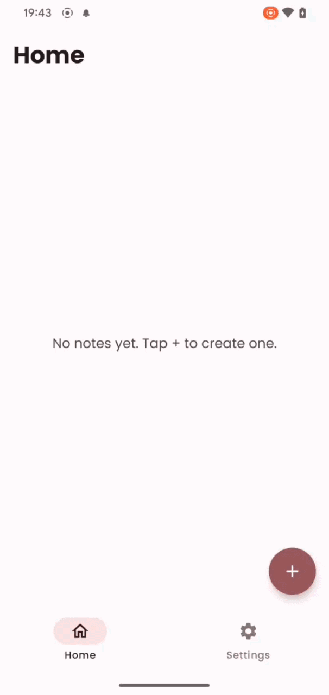
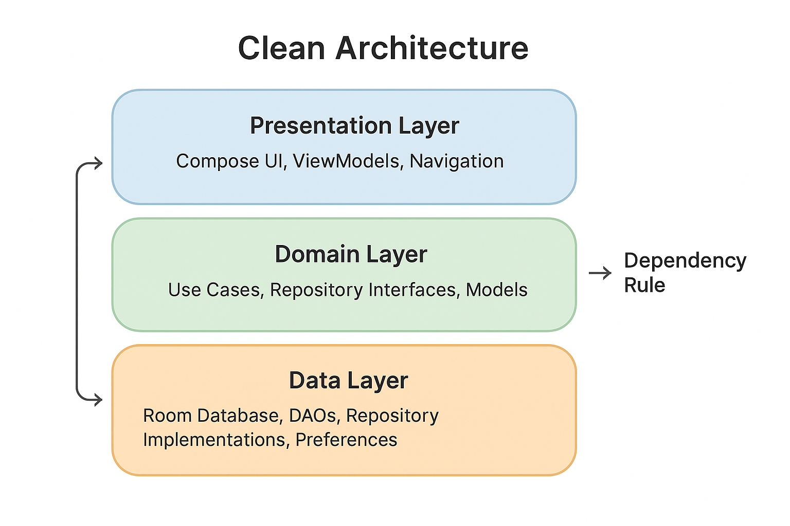
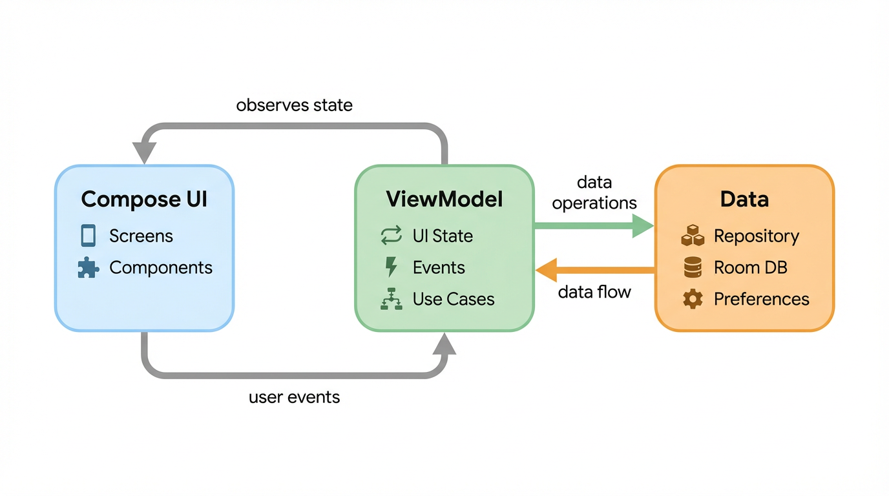

<h1 align="center">ToriNotes</h1>
<p align="center">A minimal, offline-first notes app built with Jetpack Compose & Clean Architecture.</p>

<p align="center">
  
  &nbsp;&nbsp;&nbsp;&nbsp;
  
</p>

---

## Table of Contents

* [About the Project](#about-the-project)
  * [Architecture](#architecture)
* [Tech Stacks](#tech-stacks)
* [Features](#features)
* [Project Structure](#project-structure)
* [Unit Testing](#unit-testing)
* [Environment Setup](#environment-setup)
* [Contact](#contact)

## About The Project

ToriNotes is a minimal notes application built as an assessment for Torilab. It demonstrates modern Android development practices using Jetpack Compose, Clean Architecture, and MVVM. The app allows users to create, edit, delete, and share notes — all stored locally on the device using Room Database with Paging 3 for efficient data loading.

## Architecture

The project follows **Clean Architecture** combined with **MVVM (Model-View-ViewModel)** pattern, ensuring clear separation of concerns across three layers:

<p align="center">
  
</p>

* **Domain Layer** — Contains business logic: models, repository interfaces, and use cases.
* **Data Layer** — Implements repositories, local database (Room), DAOs, entity mappers, and preferences.
* **Presentation Layer** — Compose UI screens, ViewModels, navigation, and theming.

The MVVM pattern drives the data flow between layers:

<p align="center">
  
</p>

Key architecture components:
* [ViewModel](https://developer.android.com/topic/libraries/architecture/viewmodel) — Manages UI-related data in a lifecycle-conscious way
* [Hilt](https://developer.android.com/training/dependency-injection/hilt-android) — Dependency injection
* [Navigation Compose](https://developer.android.com/guide/navigation) — Type-safe navigation with bottom navigation bar
* [Room](https://developer.android.com/training/data-storage/room) — Local database with offline-first approach
* [Paging 3](https://developer.android.com/topic/libraries/architecture/paging/v3-overview) — Efficient paginated data loading

## Tech Stacks

| Category | Libraries |
|---|---|
| **UI** | Jetpack Compose, Material 3, Coil 3 |
| **Architecture** | ViewModel, Navigation Compose, Kotlin Coroutines & Flow |
| **Data** | Room, Paging 3, SharedPreferences, Kotlinx Serialization, Gson |
| **DI** | Hilt |
| **Testing** | JUnit 4, MockK, Kotlinx Coroutines Test |
| **Tooling** | KSP |

## Features

| | |
|:--|:--|
| **Create & Edit** — Write new notes or update existing ones with real-time saves. | **Delete Bulk** — Delete multiple notes at once with a confirmation dialog. |
| **Share Anywhere** — Send notes to other apps via Android's share intent. | **Light & Dark Theme** — Switch between light and dark mode from settings. |
| **Paginated List** — Smooth scrolling with Paging 3 for large datasets. | **Offline-First** — All data stored locally with Room. No internet required. |
| **Bulk Generation** — Generate 1000 notes to stress-test performance. | **Bottom Navigation** — Quick access to Home and Settings screens. |

## Project Structure

```
app/src/main/java/torilab/assessment/notes/
├── common/                  # Shared utilities (Routes, DateUtils)
├── data/
│   ├── local/
│   │   ├── dao/             # Room DAO interfaces
│   │   ├── database/        # Room Database definition
│   │   ├── entity/          # Database entities
│   │   ├── mapper/          # Entity ↔ Domain model mappers
│   │   └── preferences/     # SharedPreferences wrapper
│   └── repository/          # Repository implementations
├── di/                      # Hilt DI modules
├── domain/
│   ├── base/                # Base UseCase interface
│   ├── model/               # Domain models
│   ├── repository/          # Repository interfaces
│   ├── usecase/             # Business logic use cases
│   └── viewstate/           # ViewState & ViewEvent interfaces
├── ui/
│   ├── base/                # Base ViewModel
│   ├── navigation/          # NavGraph & BottomNav
│   ├── screen/
│   │   ├── addeditnote/     # Add/Edit note screen & ViewModel
│   │   ├── component/       # Shared UI components (NoteCard, Dialog)
│   │   ├── home/            # Home screen & ViewModel
│   │   └── settings/        # Settings screen & ViewModel
│   └── theme/               # Theme, Colors, Typography, Shapes
├── MainActivity.kt
└── ToriNotesApplication.kt
```

## Unit Testing

The project includes unit tests across all layers of the Clean Architecture, using **JUnit 4**, **MockK**, and **Kotlinx Coroutines Test**.

```bash
# Run all unit tests
./gradlew test
```

### Coverage

| Layer | Class | Description |
|---|---|--|---|
| **Common** | `DateUtilsTest` | Date formatting with default/custom patterns and edge cases |
| **Data — Mapper** | `NoteMapperTest` | Entity ↔ Domain mapping and roundtrip consistency |
| **Data — Repository** | `NoteRepositoryImplTest` | All repository methods with DAO delegation and entity mapping |
| **Domain — UseCase** | `AddNoteUseCaseTest` | Flow emission and repository delegation |
| **Domain — UseCase** | `UpdateNoteUseCaseTest` | Flow emission and repository delegation |
| **Domain — UseCase** | `DeleteNoteUseCaseTest` | Flow emission and repository delegation |
| **Domain — UseCase** | `DeleteMultipleNotesUseCaseTest` | Batch deletion and empty list handling |
| **Domain — UseCase** | `GetNoteByIdUseCaseTest` | Found/not-found cases and repository delegation |
| **Domain — UseCase** | `GetAllNotesUseCaseTest` | Blank/non-blank query routing and query trimming |
| **Presentation** | `HomeViewModelTest` | Selection mode, toggle, search, delete, select all, navigation events |
| **Presentation** | `AddEditNoteViewModelTest` | State changes, save validation, input trimming, delete guard |
| **Presentation** | `SettingsViewModelTest` | Bulk generation, batching, offset, duplicate trigger guard |

**Total: 66 test cases**

## Environment Setup

- Android Studio **Ladybug** or newer recommended.
- **JDK 11** or higher.
- **Min SDK**: 24 (Android 7.0)
- **Target SDK**: 36

```bash
# Clone the repository
git clone git@github.com:quangchien99/torilab-assessment-notes-app.git

# Open in Android Studio and sync Gradle
# Run on emulator or physical device
```

```
Designed and developed by quangchien99

Licensed under the Apache License, Version 2.0 (the "License");
you may not use this file except in compliance with the License.
You may obtain a copy of the License at

   http://www.apache.org/licenses/LICENSE-2.0

Unless required by applicable law or agreed to in writing, software
distributed under the License is distributed on an "AS IS" BASIS,
WITHOUT WARRANTIES OR CONDITIONS OF ANY KIND, either express or implied.
See the License for the specific language governing permissions and
limitations under the License.
```
